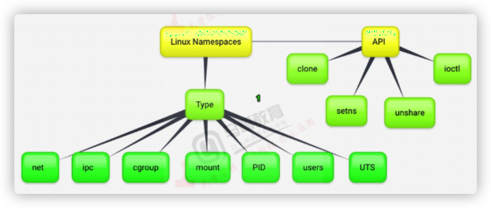
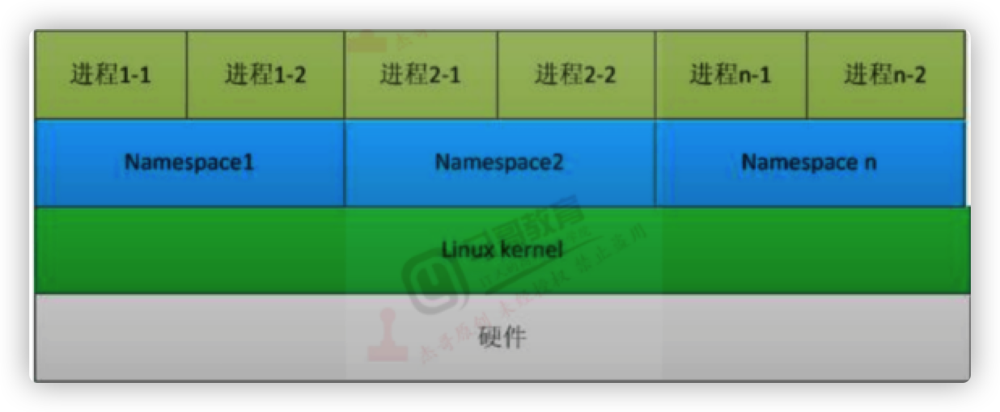
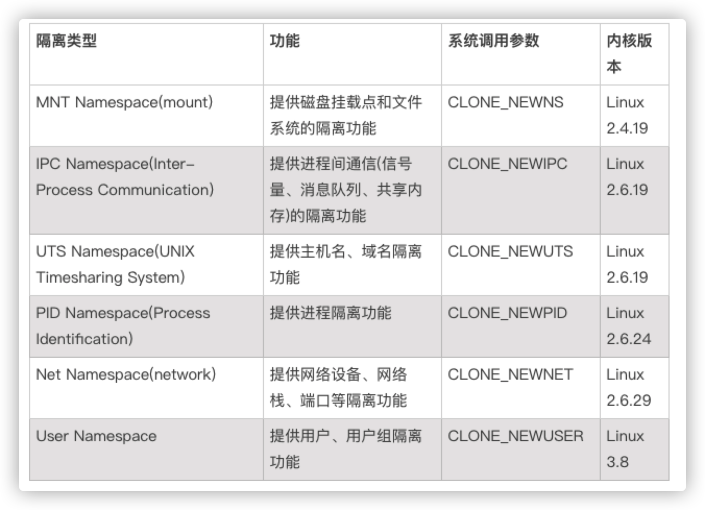

## Linux Namespace技术

>  *参考：*https://www.cnblogs.com/bakari/p/8560437.htmlLinux 

### Namespace简介    

​	Linux Namespace是Linux提供的一种内核级别环境隔离的方法。	

​	Linux Namespaces 机制提供了一种资源隔离方案。PID、IPC、Network等系统资源不再是全局性的，而是属于特定的Namespace。	

​	每个Namespace里面的资源对其他Namespace都是透明的。要创建新的Namespace，只需要在调用clone时指定相应的flag。Linux Namespaces机制为实现基于容器的虚拟化技术提供了很好的基础。





### Namespace为Docker容器实现资源隔离

​	Docker 和虚拟机技术一样，从操作系统级上实现了资源的隔离，它本质上是宿主机上的进程（容器进程），所以资源隔离主要就是指进程资源的隔离。实现资源隔离的核心技术就是 Linux namespace。

​	隔离意味着可以抽象出多个轻量级的内核（容器进程），这些进程可以充分利用宿主机的资源，宿主机有的资源容器进程都可以享有，但彼此之间是隔离的，同样，不同容器进程之间使用资源也是隔离的，这样，彼此之间进行相同的操作，都不会互相干扰，安全性得到保障。

​	为了支持这些特性，Linux namespace 实现了 6 项资源隔离，基本上涵盖了一个小型操作系统的运行要素，包括主机名、用户权限、文件系统、网络、进程号、进程间通信



**Linux Namespace技术解决了以下Docker技术问题**

* 怎么保证每个容器都有不同的文件系统并且能互不影响？
* 一个docker主进程内的各个容器都是其子进程，那怎么实现同一个主进程下不同类型的子进程？
* 每个容器怎么解决ip及端口分配的问题？
* 多个容器的主机名可以一样吗？
* 每个容器都要不要有root用户？
* 怎么解决账户重名问题？

查看进程有哪些Namespace隔离查看文件 /proc/[pid]/ns （注：该方法仅限于 3.8 版本以后的内核）

````
# ls /proc/1364/ns -l
total 0
lrwxrwxrwx 1 root root 0 Dec 24 02:18 cgroup -> cgroup:[4026531835]
lrwxrwxrwx 1 root root 0 Dec 27 10:54 ipc -> ipc:[4026531839]
lrwxrwxrwx 1 root root 0 Dec 27 10:54 mnt -> mnt:[4026531840]
lrwxrwxrwx 1 root root 0 Dec 27 10:54 net -> net:[4026531957]
lrwxrwxrwx 1 root root 0 Dec 27 10:54 pid -> pid:[4026531836]
lrwxrwxrwx 1 root root 0 Dec 27 10:54 user -> user:[4026531837]
lrwxrwxrwx 1 root root 0 Dec 27 10:54 uts -> uts:[4026531838]
````

### Namespace 隔离类型

#### MNT Namespace 

MNT Namespace提供磁盘挂载点和文件系统的隔离功能。

每个容器都要有独立的根文件系统和独立的用户空间，以实现在容器里面启动服务并且使用容器的运行环境。

例如：一个宿主机是ubuntu的服务器，可以在里面启动一个centos运行环境的容器并且在容器中启动一个nginx服务，此Nginx运行时使用的是centos系统目录的运行环境，但是在容器里面是不能访问宿主机的资源，宿主机使用了MNT Namespace技术把容器锁定到一个指定的运行目录里面并将其作为容器的根运行环境。

MNT Namespace是基于对chroot的不断改良发明出来的。

#### IPC Namespace

IPC Namespace提供进程间通信(信号量、消息队列、共享内存)的隔离功能，在一个IPC Namespace里面创建的IPC object对该Namespace内的所有进程可见，但是对其他Namespace不可见，这样就使得不同Namespace之间的进程不能直接通信，就像是在不同的系统里一样。

#### UTS Namespace

UTS Namespace 提供主机名、域名隔离功能。

UTS(Unix Timesharing System)包含了运行内核的名称、版本、底层体系结构类型等信息，用于系统标识，其中包含了主机名和域名，UTS Namespace使得一个容器拥有属于自己的hostname标识，这个hostname标识独立于宿主机系统和其上的其他容器。

#### PID Namespace

PID Namespace提供进程隔离功能

Linux系统中有一个pid为1的进程（init/systemd）是其他所有进程的父进程，那么在每个容器内也要有一个父进程来管理其下属的子进程，多个容器的进程通过PID Namespace实现进程隔离（如PID编号重复、容器内的主进程生成和回收子进程等）

#### Net Namespace

Net Namespace提供网络设备、网络栈、端口等隔离功能。

每个容器都类似于虚拟机一样有自己的网卡、监听端口、TCP/IP协议栈等。

Docker使用Network namespace启动一个vethX接口，这样容器将拥有它自己的桥接IP地址，通常是docker0，而docker0实质就是linux的虚拟网桥，网桥就是在OSI七层模型的数据链路层的网络设备，通过MAC地址对网络进程划分，并且在不同网络直接传递数据。

#### User Namespace

User Namespace提供用户、用户组隔离功能

各个容器内可能会出现重名的用户和用户组名称，或重复的UID、GID，那么怎么隔离各个容器的用户空间呢？

User Namespace允许宿主机的各个容器空间内创建相同的用户名、用户组及相同的UID、GID，只是会把用户的作用范围限制在每个容器内，即A容器和B容器可以有相同的用户名、UID的账户，但此用户的有效范围仅限于当前容器，不能访问另外一个容器内的文件系统，即相互隔离、互不影响、永不相见。

