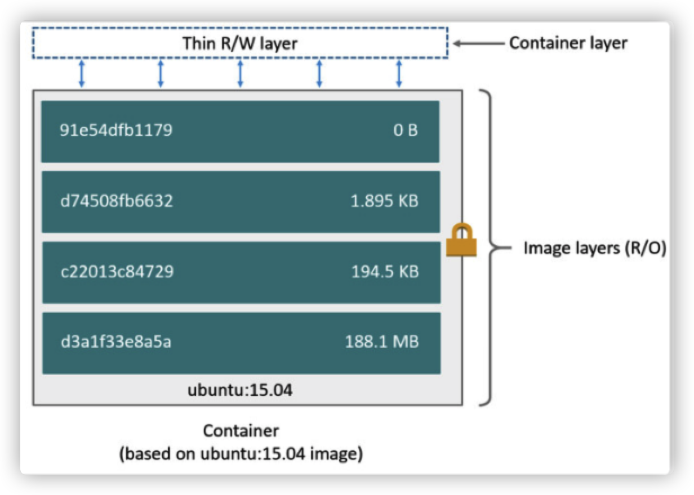
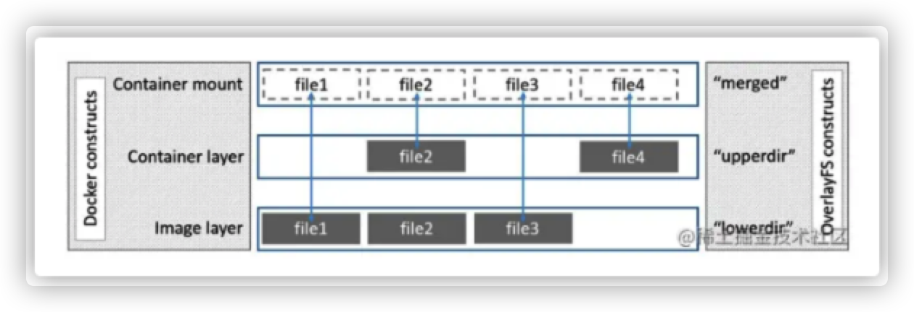

## Docker存储引擎

>参考：[https://www.cnblogs.com/Gmiaomiao/p/13174618.html](https://www.cnblogs.com/Gmiaomiao/p/13174618.html)
>
>官网文档：https://docs.docker.com/storage/storagedriver/select-storage-driver/
>
>overlay ：[https://www.cnblogs.com/lhanghang/p/13556629.html](https://www.cnblogs.com/lhanghang/p/13556629.html)

​	目前docker的默认存储引擎为overlay2，不同的存储引擎需要相应的文件系统支持，如需要磁盘分区的时候传递d-type稳健分层功能，即需要传递内核参数并开启格式化磁盘的时候指定的功能

### 设计思想

Docker 存储引擎的核心思想是“层”的概念，理解了这个层，就基本可以理解它的设计思路。当我们拉取一个 Docker 镜像的时候，往往看到如下:

```shell
# docker pull nginx
Using default tag: latest
latest: Pulling from library/nginx
a2abf6c4d29d: Downloading [========================>                          ]  15.25MB/31.36MB
f3409a9a9e73: Downloading [==================>                                ]  9.161MB/25.35MB
9919a6cbae9c: Download complete 
fc1ce43285d7: Download complete 
1f01ab499216: Download complete 
13cfaf79ff6d: Download complete
```

​	一个镜像被分成许多的“层”，每“层”包含了若干的文件，而一层层堆叠起来就组成了我们的一个完整的镜像。我们镜像中的文件就是所有“层”文件的并集。
​	我们构建 Docker 镜像一般采用 Dockerfile 的方式，而 Dockerfile 的每行命令，其实就会生成一个“层”，即使什么文件都没有添加。

```shell
FROM ubuntu:15.04
COPY . /app
RUN make /app
CMD python /app/app.py
```



​	Docker 的镜像（image）是静态的，所以当镜像构建完成后，所有的层都是只读的，并会赋予一个唯一的 ID。而容器（container）是动态的，当容器启动后，Docker 会给这个容器创建一个可读写“层”，位于所有镜像“层”的最上面。我们对容器的所有操作也就是在这个“层”里完成，当我们执行 `docker commit` 将容器生成镜像的时候，就是把这个“层”给拍了个快照，添加了一个新的只读层。

**文件的创建是在读写层增加文件，那修改和删除呢？**

这就要提一下 Docker 设计的 copy-on-write (CoW) 策略。

当我们试图读取一个文件时，Docker 会从上到下一层层去找这个文件，找到的第一个就是我们的文件。所以下面层相同的文件就被“覆盖”了。而修改就是当我们找到这个文件时，将它“复制”到读写层并修改，这样读写层的文件就是我们修改后的文件，并且“覆盖”了镜像中的文件了。而删除就是创建了一个特殊的 `whiteout` 文件，这个 `whiteout` 文件覆盖的文件即表示删除了。

**这样的设计有什么好处吗？**

第一个好处是减少了存储空间，由于镜像被分成了多个层，而各个层是静态只读的，是可以共享的。当你从一个镜像构建另一个镜像时，只需要添加新的层，原有的层不会被复制。

我们可以用 `docker history` 命令查看我们创建的镜像，相同的层将共享且只保存一份。

```shell
root@ubuntu-xenial:~# docker history  nginx
IMAGE          CREATED      CREATED BY                                      SIZE      COMMENT
f6987c8d6ed5   6 days ago   /bin/sh -c #(nop)  CMD ["nginx" "-g" "daemon…   0B        
<missing>      6 days ago   /bin/sh -c #(nop)  STOPSIGNAL SIGQUIT           0B        
<missing>      6 days ago   /bin/sh -c #(nop)  EXPOSE 80                    0B        
<missing>      6 days ago   /bin/sh -c #(nop)  ENTRYPOINT ["/docker-entr…   0B        
<missing>      6 days ago   /bin/sh -c #(nop) COPY file:09a214a3e07c919a…   4.61kB    
<missing>      6 days ago   /bin/sh -c #(nop) COPY file:0fd5fca330dcd6a7…   1.04kB    
<missing>      6 days ago   /bin/sh -c #(nop) COPY file:0b866ff3fc1ef5b0…   1.96kB    
<missing>      6 days ago   /bin/sh -c #(nop) COPY file:65504f71f5855ca0…   1.2kB     
<missing>      6 days ago   /bin/sh -c set -x     && addgroup --system -…   61.1MB    
<missing>      6 days ago   /bin/sh -c #(nop)  ENV PKG_RELEASE=1~bullseye   0B        
<missing>      6 days ago   /bin/sh -c #(nop)  ENV NJS_VERSION=0.7.0        0B        
<missing>      6 days ago   /bin/sh -c #(nop)  ENV NGINX_VERSION=1.21.4     0B        
<missing>      6 days ago   /bin/sh -c #(nop)  LABEL maintainer=NGINX Do…   0B        
<missing>      7 days ago   /bin/sh -c #(nop)  CMD ["bash"]                 0B        
<missing>      7 days ago   /bin/sh -c #(nop) ADD file:09675d11695f65c55…   80.4MB    
root@ubuntu-xenial:~# docker history  nginx:new
IMAGE          CREATED          CREATED BY                                      SIZE      COMMENT
cb6c54821a51   15 seconds ago   nginx -g daemon off;                            1.11kB    
f6987c8d6ed5   6 days ago       /bin/sh -c #(nop)  CMD ["nginx" "-g" "daemon…   0B        
<missing>      6 days ago       /bin/sh -c #(nop)  STOPSIGNAL SIGQUIT           0B        
<missing>      6 days ago       /bin/sh -c #(nop)  EXPOSE 80                    0B        
<missing>      6 days ago       /bin/sh -c #(nop)  ENTRYPOINT ["/docker-entr…   0B        
<missing>      6 days ago       /bin/sh -c #(nop) COPY file:09a214a3e07c919a…   4.61kB    
<missing>      6 days ago       /bin/sh -c #(nop) COPY file:0fd5fca330dcd6a7…   1.04kB    
<missing>      6 days ago       /bin/sh -c #(nop) COPY file:0b866ff3fc1ef5b0…   1.96kB    
<missing>      6 days ago       /bin/sh -c #(nop) COPY file:65504f71f5855ca0…   1.2kB     
<missing>      6 days ago       /bin/sh -c set -x     && addgroup --system -…   61.1MB    
<missing>      6 days ago       /bin/sh -c #(nop)  ENV PKG_RELEASE=1~bullseye   0B        
<missing>      6 days ago       /bin/sh -c #(nop)  ENV NJS_VERSION=0.7.0        0B        
<missing>      6 days ago       /bin/sh -c #(nop)  ENV NGINX_VERSION=1.21.4     0B        
<missing>      6 days ago       /bin/sh -c #(nop)  LABEL maintainer=NGINX Do…   0B        
<missing>      7 days ago       /bin/sh -c #(nop)  CMD ["bash"]                 0B        
<missing>      7 days ago       /bin/sh -c #(nop) ADD file:09675d11695f65c55…   80.4MB    
```

我们可以在系统的 `/var/lib/docker/<存储驱动>/` 下看到我们所有的层。
第二个好处是启动容器就变得非常轻量和快速。因为我们的容器只是添加了一个“空”的读写层，其他的都是复用的只读层，需要用时才会去搜索。

### 存储驱动类型

Docker 的存储引擎针对不同的文件系统，是由不同的存储驱动。

Docker 主要有一下几类存储驱动：

* overlay2：是当前版本推荐的存储驱动，无需额外的依赖和配置即可发挥绝佳的性能。在 18.09 版本之后替换了 overlay 存储驱动。支持 xfs(在ftype = 1的情况下)，ext4 文件系统。
* aufs：Docker 早期使用的存储驱动，是 Docker 18.06 版本之前，Ubuntu 14.04 版本前推荐的。支持 xfs，ext4 文件系统。
* devicemapper：是较早版本的 CentOS 和 RHEL 系统推荐的存储驱动，因为它们不支持 overlay2，需要 direct-lvm 的支持。
* btrfs：仅用于 btrfs 文件系统。
* zfs：仅用于 zfs 文件系统。
* vfs：不依赖于文件系统，但是性能奇差，主要用来测试。


需要注意的是，overlay2，overlay，aufs 的层是基于文件的，当单文件的写并发较高时需要大内存的支持，且读写层可能因为单个文件而变得很大。devicemapper，btrfs，zfs 的层是基于块存储的，因此对于单个文件的高并发影响不大。但是 btrfs 和 zfs 非常消耗内存。

 有条件的情况下，我们还是建议选择 overlay2 的存储驱动。

### OverlayFS

重点讲讲 overlayFS（overlay2 和 overlay）。

overlayFS 是从 aufs 之上改进和简化而来的，比 aufs 和 devicemapper 有更好的性能，大部分情况下也比 btrfs 好。

它将文件简化为上、下两层：

* 上面的称为 `upperdir`，可读写
* 下面的称为 `lowerdir`，只读
  统一后暴露的视图称为 `merged`。



它有如下特性：

**页缓存**：overlayFS 支持页缓存分享，多个容器如果读取相同层的同一个文件，可以共享页缓存，有效利用内存，使得它对于高并发读场景十分高效。

**层查找**：由于第一次修改只读层文件时需要复制到读写层，所以对于大文件会有一些延迟。但是 overlayFS 还是比 aufs 更快，因为在搜索和缓存方面做了不少优化。

**重命名**：overlayFS 不支持不同层文件的重命名操作，需要修改为复制然后删除。

### 查看当前docker的存储引擎

```shell
# docker info
...
 Server Version: 20.10.7
 Storage Driver: overlay2
  Backing Filesystem: extfs
  Supports d_type: true
  Native Overlay Diff: true
  userxattr: false
```

### 修改存储引擎

配置 Docker 存储驱动非常简单，只需要修改配置文件即可。

>注意：如果你原先有不同存储驱动的层数据，更换存储驱动后将不可用，建议备份镜像并清除 `/var/lib/docker` 下所有数据。
>备份镜像可以用 `docker save` 导出镜像，之后用 `docker load` 导入镜像。
> 修改前先`fdisk -l`查看文件系统类型，卸载`umount /var/lib/docker`

>注意：可能会出现`umount: /var/lib/docker: target is busy.`
>关闭占用进程`fuser -km /var/lib/docker`（慎用`fuser -km`）。在`psmisc`包中`yum install psmisc -y`或者systemctl stop docker再次进行卸载
>对文件系统进行类型格式化`mkfs.xfs -n ftype=1 /dev/sdX` 或`mkfs.ext4 /dev/sdX`

再次进行挂载`mount /dev/sdX /var/lib/docker`

创建或修改文件 `/etc/docker/daemon.json` 并添加

```plain
{
  "storage-driver": "overlay2"
}
```

然后重启 Docker

```shell
systemctl restart docker
```

或者

```shell
#修改/lib/systemd/system/docker.service 
......
ExecStart=/usr/bin/dockerd -s=overlay2
......
```

然后重启 Docker

```plain
systemctl daemon-reload
systemctl restart docker
```


###  

 

 

